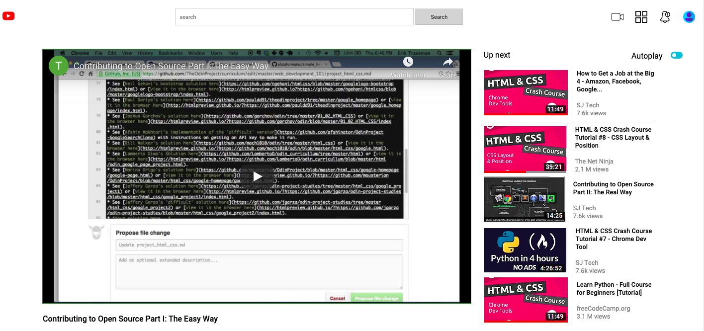

## Embedding Images and videos

This project was created to strengthen knowledge of enmbedding images and videos into a website using the youtube page as a guide.

## Built With

- HTML
- CSS

## Live Demo

[Live Demo Link](https://boring-babbage-70cb7b.netlify.app)

## Getting Started

**To view this project, download the contents of the repository to your computer or clone the repository and open the index.html file using your preferred browser.**

## Authors

👤 **Maryjane**

- Github: [@maryjane](https://github.com/maryjanee)
- Twitter: [@AlfredMaryjane](https://twitter.com/AlfredMaryjane)
- Linkedin: [Maryjane Akpagbue](https://www.linkedin.com/in/maryjane-akpagbue-1500b7173/)

👤 **Razika**

- Github: [@rahalrazika](https://github.com/rahalrazika)
- Twitter: [@RereRere055](https://twitter.com/RereRere055)
- Linkedin: [Razika Rahal](https://www.linkedin.com/in/razika-rahal-85539bbb/)

## 🤝 Contributing

Contributions, issues and feature requests are welcome!

## Show your support

Give a ⭐️ if you like this project!

## Acknowledgments

- Youtube
